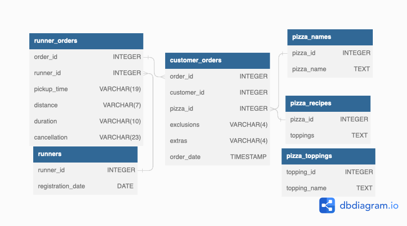

<!-- Project Title -->
<h1 align="center"> Pizza Runner - The second case study</h1>

 

<!-- Table of Contents -->
## Table of Contents

- [Introduction](#introduction)
- [Dataset](#dataset)
- [Entity Relationship Diagram](#entity-relationship)
<<<<<<< HEAD

=======
>>>>>>> 5822e78fa33b5134d5b7931101f07b9ad725c910

<!-- Introduction -->
# Introduction:

Danny was scrolling through his Instagram feed when something really caught his eye - “80s Retro Styling and Pizza Is The Future!”

Danny was sold on the idea, but he knew that pizza alone was not going to help him get seed funding to expand his new Pizza Empire - so he had one more genius idea to combine with it - he was going to Uberize it - and so Pizza Runner was launched!

Danny started by recruiting “runners” to deliver fresh pizza from Pizza Runner Headquarters (otherwise known as Danny’s house) and also maxed out his credit card to pay freelance developers to build a mobile app to accept orders from customers.

<!-- Dataset -->
# Dataset:

Runners: This table keeps a record of the date when each runner has signed up.

Customer_orders: This table logs the orders placed by customers. Each row represents a unique pizza from an order. The pizza_id column indicates the type of pizza ordered, whereas the exclusions column holds the ingredient_id(s) for any ingredient(s) that need to be omitted from the pizza. The extras column shows the ingredient_id(s) for any additional ingredient(s) requested to be added to the pizza.

Runner_orders: This table reflects the assignment of orders to the runners. However, it should be noted that not all orders make it to completion and can be canceled by either the customer or the restaurant. The pickup_time column represents the moment the runner picks up the prepared pizzas from Pizza Runner headquarters. The distance and duration columns pertain to the journey of the runner, indicating how far and long the runner has to travel to deliver the order to the client.

Pizza_names: Pizza Runner offers just two types of pizzas, Meat Lovers and Vegetarian!

Pizza_recipes: Each pizza_id corresponds to a particular set of standard toppings that are included in the recipe of that specific pizza.

Pizza_toppings: This table contains the list of all available toppings, with each topping_name matched with its corresponding topping_id.

<!-- Entity Relationship Diagram -->
# Entity Relationship Diagram: 

