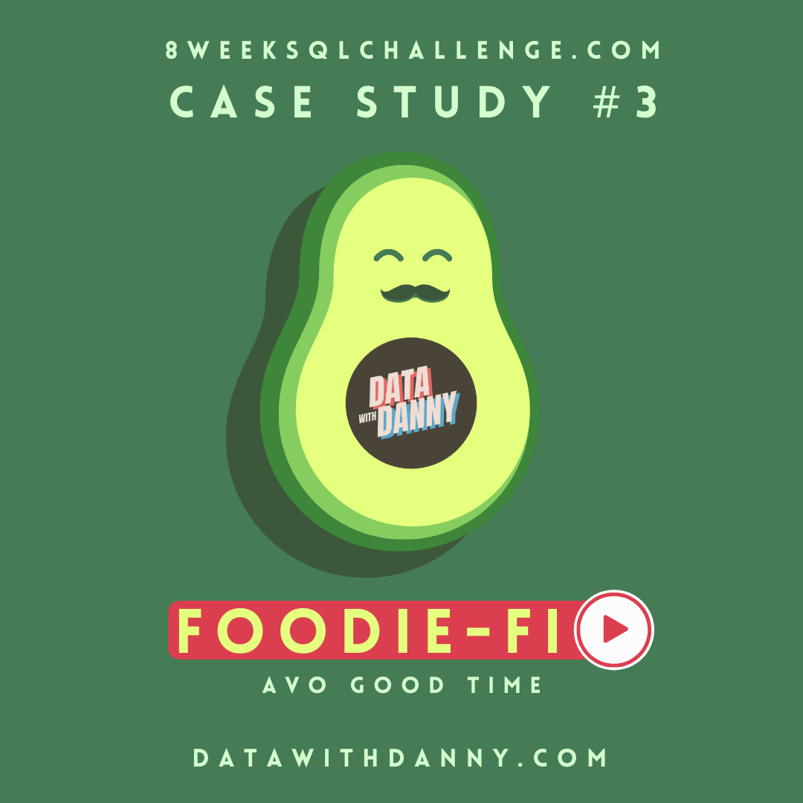

<!-- Project Title -->
<h1 align="center"> Foodie Fi - The third case study</h1>

 

<!-- Table of Contents -->
## Table of Contents

- [Introduction](#introduction)
- [Dataset](#dataset)
- [Entity Relationship Diagram](#entity-relationship)
- [Project Organization](#project-organization)
- [Usage and Instructions](#usage-and-instructions)
- [License](#license)
- [Contributing](#contributing)

<!-- Introduction -->
# Introduction:

 Danny identified a gap in the market and wanted to establish a new streaming service focused solely on food-related content, similar to Netflix but dedicated to cooking shows. In 2020, he assembled a team of talented individuals to launch his startup called Foodie-Fi. 

 They introduced monthly and annual subscription options, providing customers with unlimited on-demand access to exclusive food videos from around the world. Danny's approach to building Foodie-Fi was data-driven, ensuring that all future investment decisions and new features were based on data. This case study explores the utilization of subscription-style digital data to address crucial business questions.

<!-- Dataset -->
# Dataset:

### Table 1: Plans

 When customers sign up for Foodie-Fi, they can choose from different plans. The Basic plan offers limited access, allowing customers to stream videos only. It is available on a monthly basis for $9.90. On the other hand, the Pro plan provides unrestricted watch time and allows video downloads for offline viewing. 
 
 Pro plans start at $19.90 per month or $199 for an annual subscription. Customers who sign up for an initial 7-day free trial will automatically continue with the Pro monthly subscription plan unless they cancel, switch to the Basic plan, or upgrade to an annual Pro plan during the trial period. If customers decide to cancel their Foodie-Fi service, a churn plan record will be created with a null price, but their plan will remain active until the end of the billing period.

- Short overview: 
| plan_id |   plan_name    | price |
|---------|----------------|-------|
|    0    |     trial      |   0   |
|    1    | basic monthly  | 9.90  |
|    2    |  pro monthly   | 19.90 |
|    3    |  pro annual    |  199  |
|    4    |     churn      |  null |

 ### Table 2: Subscriptions

 The subscriptions table contains information about customer subscriptions, including the precise date when their specific plan_id becomes active. If customers choose to downgrade from a Pro plan or cancel their subscription, the higher plan will continue until the current billing period is over, and the start_date in the subscriptions table will reflect the date of the actual plan change. 

 In cases where customers upgrade from a Basic plan to a Pro or annual Pro plan, the higher plan will take effect immediately. When customers churn, they maintain access until the end of their ongoing billing period, but the start_date technically corresponds to the day they decided to cancel their service.

- Short overview: 

| customer_id | plan_id | start_date |
|-------------|---------|------------|
|      1      |    0    | 2020-08-01 |
|      1      |    1    | 2020-08-08 |
|      2      |    0    | 2020-09-20 |
|      2      |    3    | 2020-09-27 |
|     11      |    0    | 2020-11-19 |
|     11      |    4    | 2020-11-26 |
|     13      |    0    | 2020-12-15 |
|     13      |    1    | 2020-12-22 |
|     13      |    2    | 2021-03-29 |
|     15      |    0    | 2020-03-17 |
|     15      |    2    | 2020-03-24 |
|     15      |    4    | 2020-04-29 |
|     16      |    0    | 2020-05-31 |
|     16      |    1    | 2020-06-07 |
|     16      |    3    | 2020-10-21 |
|     18      |    0    | 2020-07-06 |
|     18      |    2    | 2020-07-13 |
|     19      |    0    | 2020-06-22 |
|     19      |    2    | 2020-06-29 |
|     19      |    3    | 2020-08-29 |

<!-- Entity Relationship Diagram -->
# Entity Relationship Diagram: 

