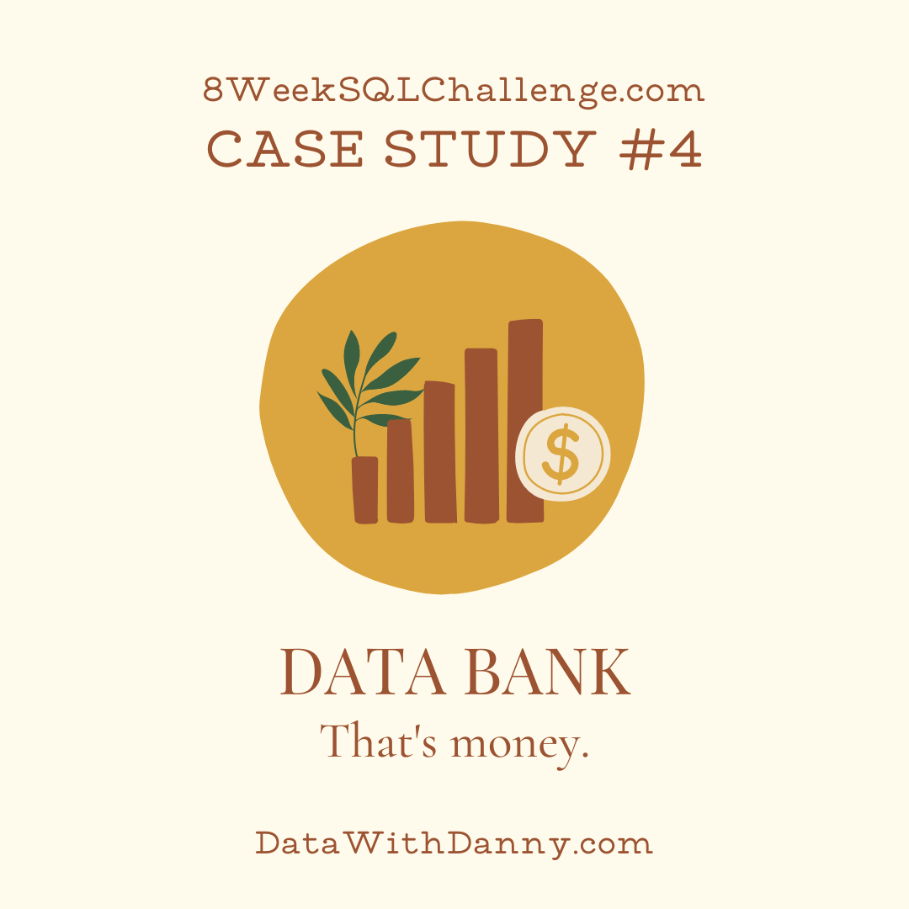

<!-- Project Title -->
<h1 align="center"> Data Bank - The fourth case study</h1>

  

<!-- Table of Contents -->
## Table of Contents

- [Introduction](#introduction)
- [Dataset](#dataset)
- [Entity Relationship Diagram](#entity-relationship)

<!-- Introduction -->
# Introduction:

A fresh concept in the financial sector called Neo-Banks is emerging, characterized by fully digital, new-age banks that have no physical branches.

Danny, inspired by this development, envisions a fusion of these modern banks, cryptocurrency, and the realm of data. Thus, he launches a revolutionary initiative known as Data Bank!

Functioning much like any other online bank, Data Bank isn't merely a platform for banking transactions. It's also home to the globe's most secure distributed data storage platform!

Customers receive cloud storage space, which is determined by the amount of money held in their accounts. However, there are some intriguing twists to this business model, which is where the Data Bank team needs your expertise!

The management at Data Bank aims to expand their overall customer base and needs assistance in monitoring the data storage requirements of their customers.

This case study centers on computing key metrics, fostering growth, and enabling the company to intelligently analyze their data. This will facilitate more accurate forecasting and strategic planning for their future progress!

<!-- Dataset -->
# Dataset:

### Table 1: Regions

Just like popular cryptocurrency platforms - Data Bank is also run off a network of nodes where both money and data is stored across the globe. In a traditional banking sense - you can think of these nodes as bank branches or stores that exist around the world.

- Short overview: 
| region_id | region_name |
|-----------|-------------|
| 1         | Africa      |
| 2         | America     |
| 3         | Asia        |
| 4         | Europe      |
| 5         | Oceania     |

 ### Table 2: Customer Nodes

Customers are randomly distributed across the nodes according to their region - this also specifies exactly which node contains both their cash and data.

This random distribution changes frequently to reduce the risk of hackers getting into Data Bank’s system and stealing customer’s money and data!

- Short overview: 

| customer_id | region_id | node_id | start_date | end_date   |
|-------------|-----------|---------|------------|------------|
| 1           | 3         | 4       | 2020-01-02 | 2020-01-03 |
| 2           | 3         | 5       | 2020-01-03 | 2020-01-17 |
| 3           | 5         | 4       | 2020-01-27 | 2020-02-18 |
| 4           | 5         | 4       | 2020-01-07 | 2020-01-19 |
| 5           | 3         | 3       | 2020-01-15 | 2020-01-23 |
| 6           | 1         | 1       | 2020-01-11 | 2020-02-06 |
| 7           | 2         | 5       | 2020-01-20 | 2020-02-04 |
| 8           | 1         | 2       | 2020-01-15 | 2020-01-28 |
| 9           | 4         | 5       | 2020-01-21 | 2020-01-25 |
| 10          | 3         | 4       | 2020-01-13 | 2020-01-14 |

### Table 3: Customer Transcations

| customer_id | txn_date  | txn_type | txn_amount |
|-------------|-----------|----------|------------|
| 429         | 2020-01-21| deposit  | 82         |
| 155         | 2020-01-10| deposit  | 712        |
| 398         | 2020-01-01| deposit  | 196        |
| 255         | 2020-01-14| deposit  | 563        |
| 185         | 2020-01-29| deposit  | 626        |
| 309         | 2020-01-13| deposit  | 995        |
| 312         | 2020-01-20| deposit  | 485        |
| 376         | 2020-01-03| deposit  | 706        |
| 188         | 2020-01-13| deposit  | 601        |
| 138         | 2020-01-11| deposit  | 520        |

<!-- Entity Relationship Diagram -->
# Entity Relationship Diagram: 

