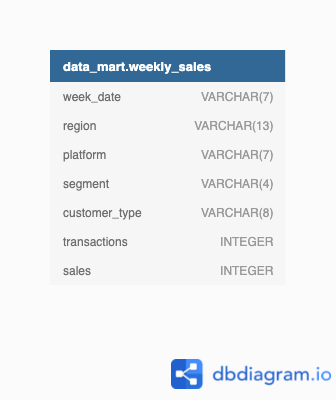

<!-- Project Title -->
<h1 align="center"> Data Mart - The fifth case study</h1>

  

<!-- Table of Contents -->
## Table of Contents

- [Introduction](#introduction)
- [Dataset](#dataset)
- [Entity Relationship Diagram](#entity-relationship)

<!-- Introduction -->
# Introduction:

Data Mart is Danny’s latest venture and after running international operations for his online supermarket that specialises in fresh produce - Danny is asking for your support to analyse his sales performance.

In June 2020 - large scale supply changes were made at Data Mart. All Data Mart products now use sustainable packaging methods in every single step from the farm all the way to the customer.

Danny needs your help to quantify the impact of this change on the sales performance for Data Mart and it’s separate business areas.

The key business question he wants you to help him answer are the following:

- What was the quantifiable impact of the changes introduced in June 2020?
- Which platform, region, segment and customer types were the most impacted by this change?
- What can we do about future introduction of similar sustainability updates to the business to minimise impact on sales?

<!-- Dataset -->
# Dataset:

### Table 1: Weekly Sales

Just like popular cryptocurrency platforms - Data Bank is also run off a network of nodes where both money and data is stored across the globe. In a traditional banking sense - you can think of these nodes as bank branches or stores that exist around the world.

- Short overview: 

| week_date | region        | platform | segment | customer_type | transactions | sales       |
|-----------|---------------|----------|---------|---------------|--------------|-------------|
| 9/9/20    | OCEANIA       | Shopify  | C3      | New           | 610          | 110033.89   |
| 29/7/20   | AFRICA        | Retail   | C1      | New           | 110692       | 3053771.19  |
| 22/7/20   | EUROPE        | Shopify  | C4      | Existing      | 24           | 8101.54     |
| 13/5/20   | AFRICA        | Shopify  | null    | Guest         | 5287         | 1003301.37  |
| 24/7/19   | ASIA          | Retail   | C1      | New           | 127342       | 3151780.41  |
| 10/7/19   | CANADA        | Shopify  | F3      | New           | 51           | 8844.93     |
| 26/6/19   | OCEANIA       | Retail   | C3      | New           | 152921       | 5551385.36  |
| 29/5/19   | SOUTH AMERICA | Shopify  | null    | New           | 53           | 10056.2     |
| 22/8/18   | AFRICA        | Retail   | null    | Existing      | 31721        | 1718863.58  |
| 25/7/18   | SOUTH AMERICA | Retail   | null    | New           | 2136         | 81757.91    |

Column dictionary: 

The columns are pretty self-explanatory based on the column names but here are some further details about the dataset:

- Data Mart has international operations using a multi-region strategy.
- Data Mart has both, a retail and online platform in the form of a Shopify store front to serve their customers.
- Customer segment and customer_type data relates to personal age and demographics information that is shared with Data Mart.
- Transactions is the count of unique purchases made through Data Mart and sales is the actual dollar amount of purchases.
- Each record in the dataset is related to a specific aggregated slice of the underlying sales data rolled up into a week_date value which represents the start of the sales week.

Data cleaning is required using: 

In a single query, perform the following operations and generate a new table in the data_mart schema named clean_weekly_sales:

- Convert the week_date to a DATE format.
- Add a week_number as the second column for each week_date value, for example any value from the 1st of January to 7th of January will be 1, 8th to 14th will be 2 etc.
- Add a month_number with the calendar month for each week_date value as the 3rd column.
- Add a calendar_year column as the 4th column containing either 2018, 2019 or 2020 values.
- Add a new column called age_band after the original segment column using the following mapping on the number inside the segment value.

| Segment | Age Band     |
|---------|--------------|
| 1       | Young Adults |
| 2       | Middle Aged  |
| 3       | Retirees     |
| 4       | Retirees     |

- Add a new demographic column using the following mapping for the first letter in the segment values:

| Segment | Demographic |
|---------|-------------|
| C       | Couples     |
| F       | Families    |

- Ensure all null string values with an "unknown" string value in the original segment column as well as the new age_band and demographic columns.

- Generate a new avg_transaction column as the sales value divided by transactions rounded to 2 decimal places for each record.

<!-- Entity Relationship Diagram -->
# Entity Relationship Diagram: 

